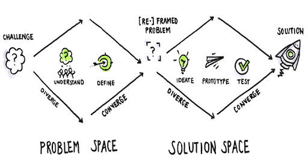
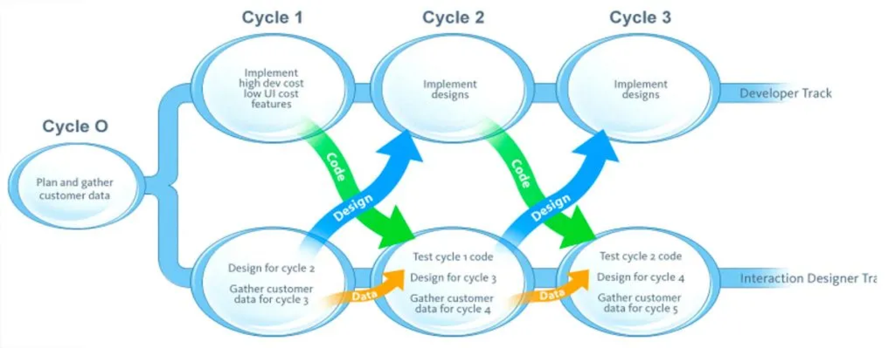

# WAE Healthcare Staffing Platform

# **Overview**

## **Context**

In a fast-paced startup environment, I led UX and product design for a staffing app designed to simplify job scheduling and order fulfillment. After an external development team delivered an expensive, non-functional MVP, I was brought in to guide the internal product design and development process. Faced with limited resources, misaligned priorities, and early restructuring challenges, I championed a user-centered approach that emphasized collaboration and iterative improvement through scalable development processes.

## **My Role**

When I joined, the project lacked structure, vision, and a clear connection to user needs. Engineering was scaling rapidly without roadmaps or product leadership, resulting in fragmented workflows and missed opportunities. As the sole UX professional, I designed solutions rooted in user needs and established scalable processes to foster alignment and collaboration across teams and stakeholders.

Outsourced MVP solution had to be scrapped, so I was brought in

## Challenge

- Launch two brands (Medical Staffing Org, General Staffing Org) and a functional MVP in under six months.
- No design systems, roadmaps, stakeholder alignment, workflows or delivery process.
- Collaboration across departments was informal and siloed. Engineering was scaling fast, but without any product leadership or shared vision; no roadmaps, requirements or timelines had been defined.

## Approach

Build trust across departments, establish collaborative systems and processes while focusing our product strategy around user needs. My design team would set the bar appropriately by modeling the collaborative communication-driven operational standards we needed across departments.

I focused our product design strategy around:

- **Empathizing with Users:** Conducting extensive research to uncover pain points and align product direction with user needs.
- **Driving Collaboration:** Establishing cross-functional alignment between Product, Engineering, and UX with scalable agile methodologies and transparent DesignOps systems.
- **Iterative Design Leadership:** Leading rapid prototyping, user testing, and iterative feedback loops to ensure the usability success.

## Discovery

In early discovery research, I identified users most significant challenges, enabling us to focus MVP functionality on our job order scheduling workflows. The unique functionality I created became the cornerstone of our product, designed to replicate users’ existing workflows while eliminating inefficiencies.

## **High-Level Project Timeline**

1. **Initial Vision:** Address inefficiencies in staffing workflows with a digital solution tailored for healthcare and other industries during the height of the COVID-19 crisis.
2. **MVP Challenges:** Initial external development efforts delivered a non-functional MVP with critical gaps in usability and functionality, highlighting the need for an iterative, user-centered process.
3. **Building the Team:** Joining a project with no product manager, I tackled UX, planning and strategy amidst rapid engineering growth.
4. **Strategic Reorganization:** I advocated for and implemented a “three-in-a-box” model, aligning Product, Engineering, and UX to foster collaboration and accountability.
5. **Scalable Processes:** Introduced systems like dual-track agile and centralized DesignOps to streamline workflows and enhance collaboration and scalability.
6. **Feature Development:** Designed and iteratively refined scheduling functionality to address users’ primary challenges while maintaining familiarity by mimicking existing internal workflows.
7. **Results:** Delivered measurable outcomes, including a 50% reduction in scheduling time and average satisfaction scores rising 44%.

# **Foundations for Success**

## **Challenge**

To create a foundation for innovation and collaboration, I implemented a scalable DesignOps framework that emphasized user-centricity, transparency, and scalability.

## Solutions

1. **Centralized Design System:**
    - Created a Figma library and design system with reusable components organized by atomic design principles. Establishing this single source of truth ensured consistency across features while allowing for rapid iteration.
    - The system’s clear structure empowered developers and stakeholders to understand and contribute seamlessly and increased our speed, transparency and consistency across features.
2. **Documentation Hub:**
    - Created and maintained a comprehensive documentation wiki live-linking design assets in our Figma design system to interaction notes and usage guidelines, empowering stakeholders to access real-time updates independently to eliminate bottlenecks.
3. **Iterative Workflows:**
    - Embedded rapid prototyping and user testing processes into agile sprints and Jira, ensuring designs were validated against user needs before reaching development.

## **Impact**

- Streamlined collaboration between teams by creating a shared language and reducing ambiguity during handoffs.
- Accelerated onboarding for new team members by providing centralized, self-serve documentation.
- Enabled consistent, scalable design iterations that aligned with user expectations.

[Comprehensive docs wiki](https://www.loom.com/share/6c87af898ab141399726671d54c25856?sid=67ceb835-5c03-4cf7-866c-b47a464a64e1)

Comprehensive docs wiki

# **Rebalancing the Team for Success**

## **Challenge**

The engineering-led development process lacked focus and accountability, with misaligned goals and fragmented workflows. UX and product planning were under-resourced, slowing progress and creating bottlenecks.

## **Solution**

I proposed the initiative to implement “three-in-a-box” model, creating a balanced partnership between Product, Engineering, and UX.

- Formalized Product Management: Focused on roadmap development and strategic prioritization.
- Elevated UX: Positioned as an equal partner to drive data-informed, user-centered decisions.
- Fostered Collaboration: Encouraged engineers to contribute to feasibility discussions, aligning technical capabilities with user needs.

## **Impact**

- Improved accountability and alignment, enabling teams to work cohesively toward user-centered goals.
- Reduced delays caused by misaligned priorities, ensuring smoother development cycles.

# **Integrating Dual-Track Agile Methodology**

## Challenge

Traditional handoffs between design and development created delays and misalignment, leaving little room for iteration based on real user feedback. By introducing dual-track agile, I bridged this gap, allowing discovery and delivery to operate in parallel.

## Solution

### Discovery Track

Focused on understanding user needs, validating ideas, and aligning stakeholders:

- User interviews/feedback, rapid prototyping and testing.
- Collaborative workshops involving stakeholders and end users.

### Delivery Track

Built validated solutions with sprint-based development:

- Used prototypes as a shared language to bridge design and engineering.
- Incorporated iterative feedback loops into agile sprint-based development workflows for continuous informed refinement.

Weekly syncs ensured alignment between both tracks, creating a seamless workflow that kept user empathy at the forefront of a data-driven process.

Two tracks, one focused on discovery (problem space), and one on delivery (solution space)

UX tasks divided into two tracks, each informing the following sprint for continuous learning and informed execution

## **Impact**

1. **Early Validation:** Reduced rework by ensuring only validated designs entered development.
2. **Faster Iterations:** Enabled parallel progress on new features and refinement of existing ones.
3. **Improved Collaboration:** Prototypes became a shared language, bridging gaps between design and development while ensuring stakeholder clarity.

## Approach

I prioritized deep user understanding through workshops, interviews, and competitive analysis, uncovering pain points and opportunities to create more empathetic, effective solutions.

# **Feature Development: Large Job Order Scheduling**

## **Challenge**

A major pain point was variability in shift patterns creating a compounding increase in complexity as order size increased, drastically limiting ability to process larger orders. By conducting extensive user-testing and leading cross-functional collaborative workshops, I uncovered opportunities for intuitive solutions that retained the familiarity of their existing internal workflows.

## **Solution**

- **Spreadsheet-Like Input:** Provided tabular fields to replicate users’ familiar workflows.
- **Auto-Fill Patterns:** Streamlined repetitive tasks through predefined templates.
- **Customizable Templates:** Allowed users to edit templates to fit their unique shift requirements.

Our solutions were rapidly prototyped and tested with real users

## **Impact:**

This feature saved users significant time, improved accuracy, and became the app’s standout feature.

# Stakeholder Collaboration & Engagement

## Community & Client Involvement

For some of our most productive user-testing sessions, I involved real clients early, inviting them to test-drive prototypes for critical features and flows. 

This provided us with not only invaluable feedback from real users, but also strengthened relationships with our clients and advertised the innovations being developed to address their specific needs.

Many versions of flows were prototyped and tested by real clients and stakeholders

### Impact

- Clients became strategic collaborators. Their input directly shaped user flows and prioritization.
    - Built trust and excitement for the roadmap while strengthening sales relationships and client retention.
- Received actionable, high-quality feedback grounded in real-world use.
- Huge boost to KPIs
    - Average user satisfaction scores increased from 52% to 96%.
    - Users reported a 50% reduction in scheduling time.
    - Simplicity and efficiency of design described as a “game changer” for users’ daily tasks.

# **Conclusion and Lessons Learned**

## **Reflections**

This project exemplified the power of user empathy, iterative design, and cross-functional collaboration. By aligning teams, introducing scalable processes, and continuously validating solutions, I delivered a product that addressed user pain points and drove measurable outcomes.

The scalable systems and methodologies I implemented position the app for ongoing innovation. Future iterations will continue to evolve based on user insights, ensuring the product remains adaptable to changing needs.

This project demonstrates civic design in practice:

- Scaling systems in resource-constrained environments.
- Building transparent, participatory workflows.
- Centering both the user and the community in every decision.

It's the kind of mission-driven, community-connected work I'm most proud of-and the type of public innovation I want to keep driving.